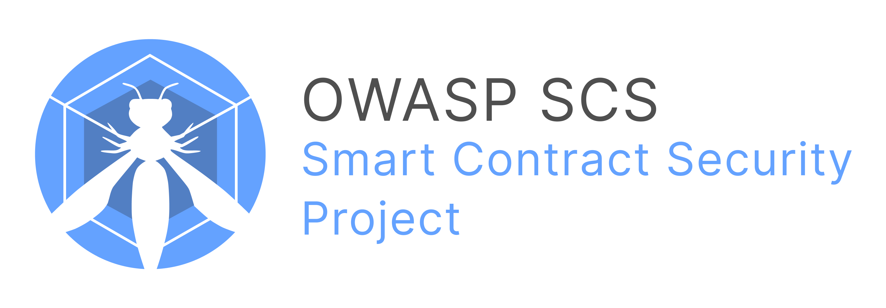

# OWASP Smart Contract Security (SCS)

This is the official GitHub Repository of the OWASP Smart Contract Security (SCS) project. This comprehensive initiative provides security standards, guidance, and resources for smart contract development, auditing, and verification. The SCS ecosystem consists of interconnected sub-projects that complement one another to promote robust security practices and compliance in smart contracts, decentralized applications (dApps) and EVM-based blockchain systems.

## 📚 **Overview**

The SCS project is structured around several interrelated resources, each serving a distinct purpose in the lifecycle of smart contract security:

- **[OWASP Smart Contract Security Verification Standard (SCSVS)](https://scs.owasp.org/SCSVS):** A baseline security standard designed to help developers, auditors, and organizations assess the security posture of smart contracts.
- **[OWASP Smart Contract Security Testing Guide (SCSTG)](https://scs.owasp.org/SCSTG):** A comprehensive testing guide with practical methodologies for auditing and testing smart contracts.
- **[OWASP Smart Contract Weakness Enumeration (SCWE)](https://scs.owasp.org/SCWE):** A classification scheme of common vulnerabilities and weaknesses in smart contracts.
- **[OWASP Smart Contract Top 10](https://scs.owasp.org/sctop10):** A curated list of the top 10 most critical risks in smart contracts.
- **[OWASP SCS Checklist](https://scs.owasp.org/checklists):** A practical, actionable checklist for verifying compliance with the SCSVS controls and implementing security best practices.

---

## 🔗 **How These Components Complement Each Other**

1. **SCSVS**: The foundation of the project, providing a structured framework of security controls.
2. **SCSTG**: Demonstrates how to test and validate controls defined in the SCSVS.
3. **SCWE**: Maps weaknesses to relevant controls, helping in identifying and mitigating vulnerabilities effectively.
4. **Smart Contract Top 10**: Raises awareness of critical risks, offering insights into prioritizing security measures.
5. **SCS Checklist**: Serves as a practical, implementation-ready tool for quick verification of controls.

These resources are designed to work together seamlessly, creating a unified ecosystem for smart contract security.

---

## 🎯 **Purpose and Goals**

- Establish a **unified security standard** for smart contract development and auditing.
- Provide **actionable testing methodologies** and resources for security practitioners.
- Create a **taxonomy of vulnerabilities** to help developers and auditors identify and address common issues.
- Enable **compliance** with security best practices through practical tools like checklists.
- Foster a **community-driven approach** to advancing smart contract security.

---

### **Contribute**
We encourage contributions from the community to enhance and expand the SCS resources. If you're interested in contributing, please refer to our [contribution guide](https://scs.owasp.org/contributing).

- **Project Leader:** [Shashank](https://www.linkedin.com/in/shashank-in/).

To get involved or contact the leadership, please visit the [OWASP Contact Page](https://scs.owasp.org/contact/)

---
### **Engage with the Community**
Join the discussion and stay updated by following the OWASP SCS community on our official channels.

> [Request an invitation](https://owasp.slack.com/archives/C07MNDE6TPZ) to join our Slack channel `#owasp-scs`

---

## 🛠️ **Use Cases**

- **Developers:** Build secure smart contracts using the SCS resources as a blueprint.
- **Auditors:** Leverage the SCSTG and SCWE to identify and mitigate vulnerabilities.
- **Organizations:** Implement the SCSVS to assess and demonstrate compliance with security best practices.
- **Researchers:** Explore the SCS projects for insights into emerging risks and weaknesses.

---

### 🌐 **Visit Us**

Explore the full project at **[OWASP SCS Official Website](https://scs.owasp.org)**.
