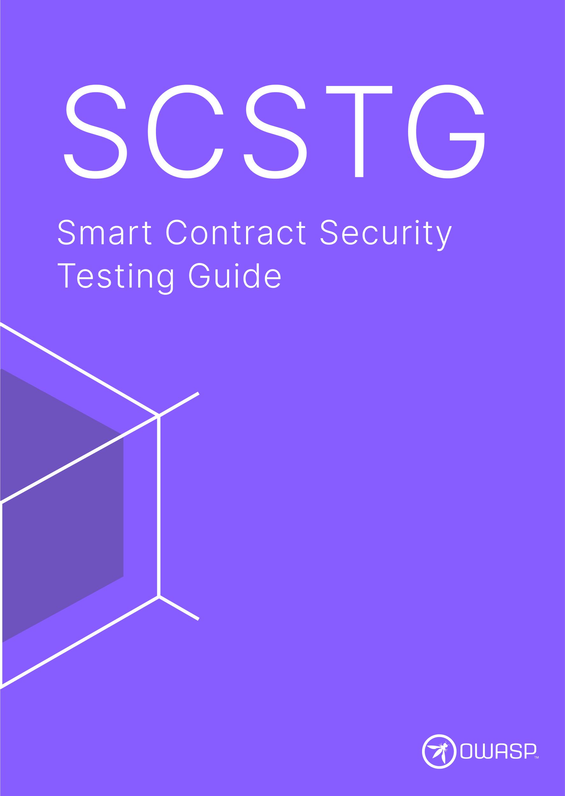

---
hide:
  - toc
---

# OWASP SCSTG

<a href="https://github.com/OWASP/owasp-scstg/">:material-github: GitHub Repo</a>

The **OWASP Smart Contract Security Testing Guide (SCSTG)** is a comprehensive manual designed to assist developers, auditors, and security professionals in evaluating the security of smart contracts. It provides detailed methodologies for identifying, verifying, and addressing vulnerabilities in smart contracts across various risk categories. The guide includes examples of common security flaws, methods for detecting these issues, and strategies for mitigating or eliminating the risks. 

It describes technical processes for verifying the controls listed in the [OWASP SCSVS](https://scs.owasp.org/SCSVS) through the weaknesses defined by the [OWASP SCWE](https://scs.owasp.org/SCWE).

 

<button class="scs-button" onclick="window.location.href='https://github.com/OWASP/owasp-scstg/releases/latest/download/OWASP_SCSTG.pdf';"> Download the SCSTG</button>

 

Start exploring the SCSTG:

<a href="/SCSTG/tests/" class="md-button md-button--primary" style="margin: 5px; min-width: 12em; text-align: center;">:octicons-codescan-checkmark-24:  Tests (v1)</a>

 :blue_heart:{ .pump } Support the project by purchasing the [OWASP SCSTG on leanpub.com](https://leanpub.com/owasp-scstg). All funds raised through sales of this book go directly into the project budget and will be used to for technical editing and designing the book and fund production of future releases.

 
