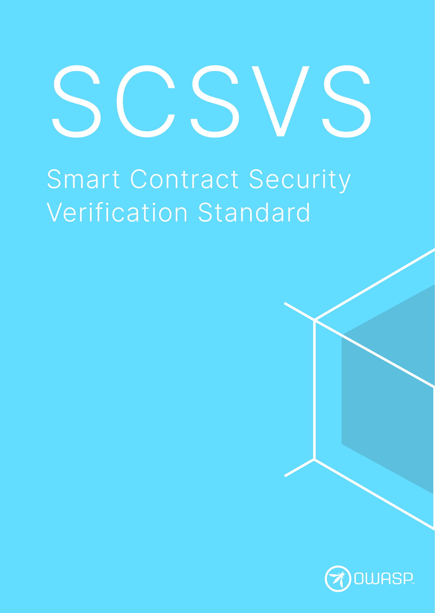

---
hide:
  - toc
search:
  exclude: true
---

# OWASP SCSVS

<a href="https://github.com/OWASP/owasp-scsvs/">:material-github: GitHub Repo</a>

The **Smart Contract Security Verification Standard (SCSVS)** is a list of specific security requirements or tests for smart contracts, primarily written in Solidity and deployed on EVM-based blockchains. These requirements are intended to be used by architects, developers, testers, security professionals, tool vendors, and consumers to define, build, test, and verify secure smart contracts, decentralized applications (dApps) and blockchain protocols. The standard promotes best practices for ensuring the security and integrity of smart contracts and decentralized finance (DeFi) systems.

To complement the SCSVS, the OWASP SCS project also provides the [OWASP Smart Contract Security Testing Guide (SCSTG)](https://scs.owasp.org/SCSTG), the [OWASP Smart Contract Weakness Enumeration (SCWE)](https://scs.owasp.org/SCWE) and the [OWASP SCS Checklist](../checklists/index.md) which together are the perfect companion for verifying the controls listed in the OWASP SCSVS and demonstrate compliance.

 

<button class="scs-button" onclick="window.location.href='https://github.com/OWASP/owasp-scsvs/releases/download/v0.0.1/OWASP_Smart_Contract_Security_Verification_Standard-0.0.1_en.pdf';"> Download the SCSVS</button>

 

## The SCSVS Control Groups

The standard is divided into various groups of controls, labeled **SCSVS-XXXXX**, that represent the most critical areas of the mobile attack surface:

- **SCSVS-ARCH**: Secure storage of sensitive data on a device (data-at-rest).
- **SCSVS-CODE**: Cryptographic functionality used to protect sensitive data.
- **SCSVS-GOV**: Authentication and authorization mechanisms used by the mobile app.
- **SCSVS-GOV**: Secure network communication between the mobile app and remote endpoints (data-in-transit).
- **SCSVS-COMM**: Secure interaction with the underlying mobile platform and other installed apps.
- **SCSVS-CODE**: Security best practices for data processing and keeping the app up-to-date.
- **SCSVS-ORACLE**: Resilience to reverse engineering and tampering attempts.
- **SCSVS-BLOCK**: Privacy controls to protect user privacy.

!!! warning "SCS Testing Profiles"

    **The SCS project has traditionally provided three verification levels (L1, L2 and L3), which were revisited during the SCSVS refactoring in 2024, and have been reworked as ["SCS Testing Profiles"]().
      
    While we move things around and as a temporary measure, the [OWASP SCS Checklist](../checklists/index.md) will still contain the verification levels, associated with the current SCSTG v0.0.1 tests.

  
