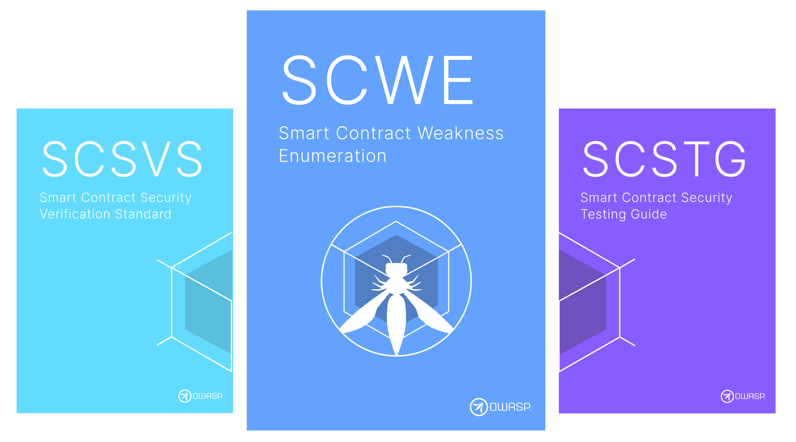

??? info "About the SCWE"

    The Smart Contract Security Weakness Enumeration (SCWE) is a list of common security and privacy weaknesses in mobile applications. It is intended to be used as a reference for developers, security researchers, and security professionals. It acts as the bridge between the [SCSVS](https://scs.owasp.org/SCSVS) and the [SCSTG](https://sas.owasp.org/SCSTG).

    

    
    

    For its definition we draw inspiration from the [Common Weakness Enumeration (CWE)](https://cwe.mitre.org/), which is a community-developed list of common software security weaknesses. The SCWE is intended to be a **complementary list to the CWE**, focusing specifically on security weaknesses in mobile applications.

    A **weakness** is a security or privacy issue that can be introduced into a mobile application. Weaknesses are categorized by the MASVS categories and controls. For example, a weakness related to the use of insecure random number generators is categorized under the `MASVS-CODE-1` control.

    Each weakness contains the following information:

    - **Overview**: A brief description of the weakness.
    - **Impact**: The potential impact of the weakness on the security or privacy of the application.
    - **Modes of Introduction**: The ways in which the weakness can be introduced into an application.
    - **Mitigations**: Recommendations for mitigating the weakness.

    > **"Weakness vs Vulnerability"**: It is important to note that **a weakness is not a vulnerability**, but it can lead to the introduction of vulnerabilities. According to the [CWE](https://cwe.mitre.org/documents/glossary/#Weakness), a weakness is a condition in a software, firmware, hardware, or service component that, under certain circumstances, could contribute to the introduction of vulnerabilities. Whereas a vulnerability is a flaw in a software, firmware, hardware, or service component resulting from a weakness that can be exploited, causing a negative impact to the confidentiality, integrity, or availability of an impacted component or components.
