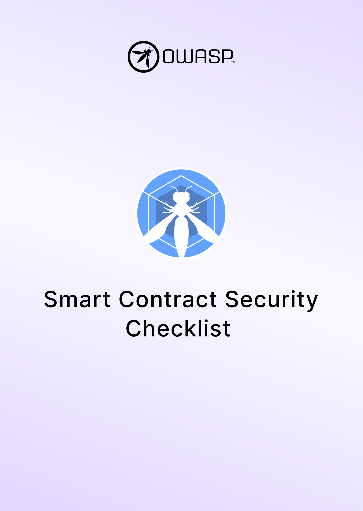

---
hide:
  - toc
search:
  exclude: true
---

# OWASP SCS Checklist

The OWASP Smart Contract Security Checklist contains links to the SCSTG test cases for each SCSVS control.

- **Security Assessments / Pentests**: ensure you're at least covering the standard attack surface and start exploring.
- **Standard Compliance**: includes SCSVS and SCSTG versions and commit IDs.
- **Learn & practice** your smart contract security skills.
- **Bug Bounties**: go step by step covering the smart contract attack surface.

 

<button class="scs-button" onclick="window.location.href='https://github.com/OWASP/owasp-scstg/releases/latest/download/OWASP_SCS_Checklist.xlsx';"> Download the SCS Checklist</button>

 
