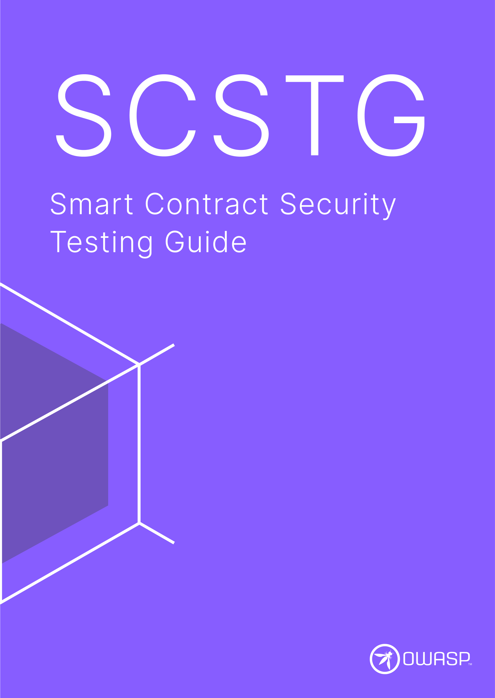

---
hide:
  - navigation
  - toc
---

# OWASP Smart Contract Security

## Our Mission

<blockquote>"Define the industry standard for Smart Contract security."</blockquote>

The OWASP Smart Contracts Security (SCS) is a comprehensive project aimed at enhancing the security of smart contracts. It provides a structured framework for developers, auditors, and security professionals to follow best practices, detect vulnerabilities, and implement robust security measures in smart contracts, decentralized applications (dApps) and EVM-based blockchain systems.

<h2>OWASP SCSVS</h2>

 

<button class="scs-button" onclick="window.location.href='https://github.com/OWASP/owasp-scsvs/releases/download/v0.0.1/OWASP_Smart_Contract_Security_Verification_Standard-0.0.1_en.pdf';"> Download the SCSVS</button>

<h2>OWASP SCWE</h2>

 

<button class="scs-button" onclick="window.location.href='../SCWE';"> Access the Beta</button>

<h2>OWASP SCSTG</h2>

 

<button class="scs-button" onclick="window.location.href='https://github.com/OWASP/owasp-scstg/releases/latest/download/OWASP_SCSTG.pdf';"> Download the SCSTG</button>

<h2>OWASP SCS Checklist</h2>

 

<button class="scs-button" onclick="window.location.href='https://github.com/OWASP/owasp-scstg/releases/latest/download/OWASP_SCS_Checklist.xlsx';"> Download the Checklist</button>

 

## Trusted By

The OWASP SCSVS and SCSTG are trusted by the following platform providers and standardization, governmental and educational institutions. [Learn more](SCSTG/0x02b-SCSVS-SCSTG-Adoption.md).

## 🥇 SCS Advocates

    
    
    
    

SCS Advocates are key industry adopters of the OWASP SCSVS and SCSTG who have invested a significant and consistent amount of resources to drive the project forward and ensure its continued success. This includes making consistent high-impact contributions and actively promoting the adoption and usage of the project. [Learn more](SCSTG/0x02c-Acknowledgements.md).

 
